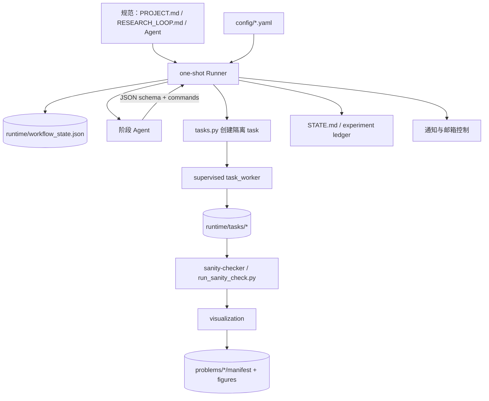
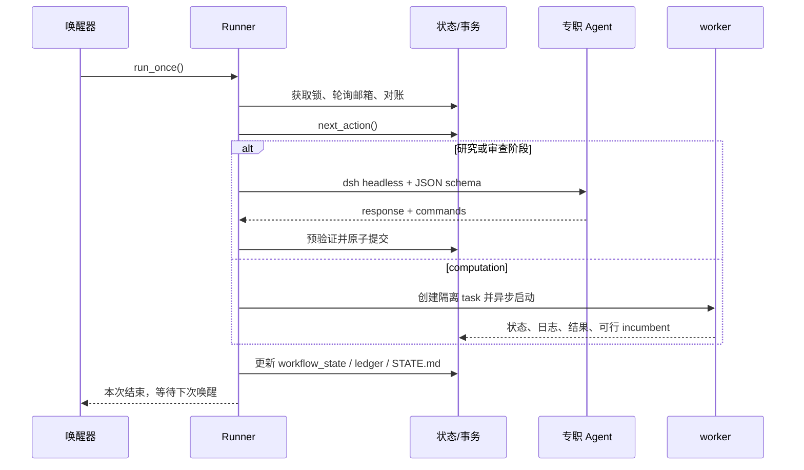
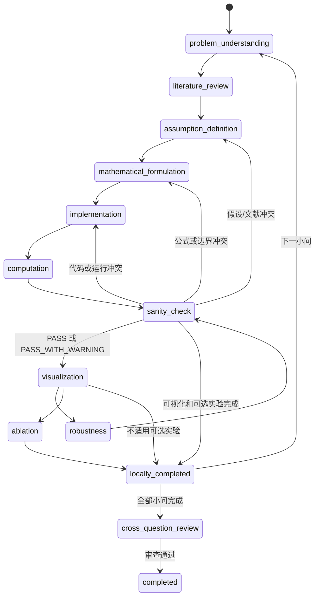

# AutoMM 数学建模 Harness 架构

## 设计目标

AutoMM 将一场数学建模比赛拆成可唤醒、可恢复、可审计的工作流。控制层只依赖文件状态，不要求某个模型会话永久存活。主阶段按小问顺序推进；同一小问内部的候选模型和实验可以受并发上限约束并行。

## 主循环

每次唤醒只做一次动作：获取 Runner 锁、轮询控制邮箱、对账 task/PID/事务、读取状态并选择 `next_action()`；需要研究时调用一个 Agent，需要计算时创建异步 task；最后校验响应、原子应用命令、渲染状态并释放锁。Agent action 超时保存草稿和日志，进入 `retrying`；Harness invariant 错误严格暂停。

## 小问阶段和门禁

允许人工 `blocked` 的范围仅包括输入缺失、凭据或远端服务不可用、必须人工选择的互斥目标、所有合法 formulation 失败，以及无法安全恢复的 Harness 状态。SMTP、Agent 超时、worker 被回收、Python/求解器异常和非关键实验失败都必须自动恢复或进入降级审查。

## 版本、结果和追踪

假设版本不可覆盖；每次修订创建新的 `assumption_vNNN`。版本目录内的工作代码允许清理和更新，但 task、输出、日志和 manifest 必须保留 attempt、代码/config/input hash、公式与假设版本、随机种子和生成时间。结论使用 `conclusion_id/version/content_hash`，前序结论变化会把后续小问标记为 stale。

完整模型不需要外部 baseline，但 robustness/ablation（若适用）必须以内置完整模型为内部对照。`mip_gap=None` 或未证明全局最优只要存在可行 incumbent、完整 solver 状态和约束残差，即可 `PASS_WITH_WARNING`；NaN/Inf、硬约束违反、单位维度错误、输入被修改和追踪缺失仍是硬失败。

论文写作在此版本不自动生成；所有小问完成后仅生成 `reports/final_summary.md`，归档中间过程、引用、结果和图表，交由人工论文手整理。
