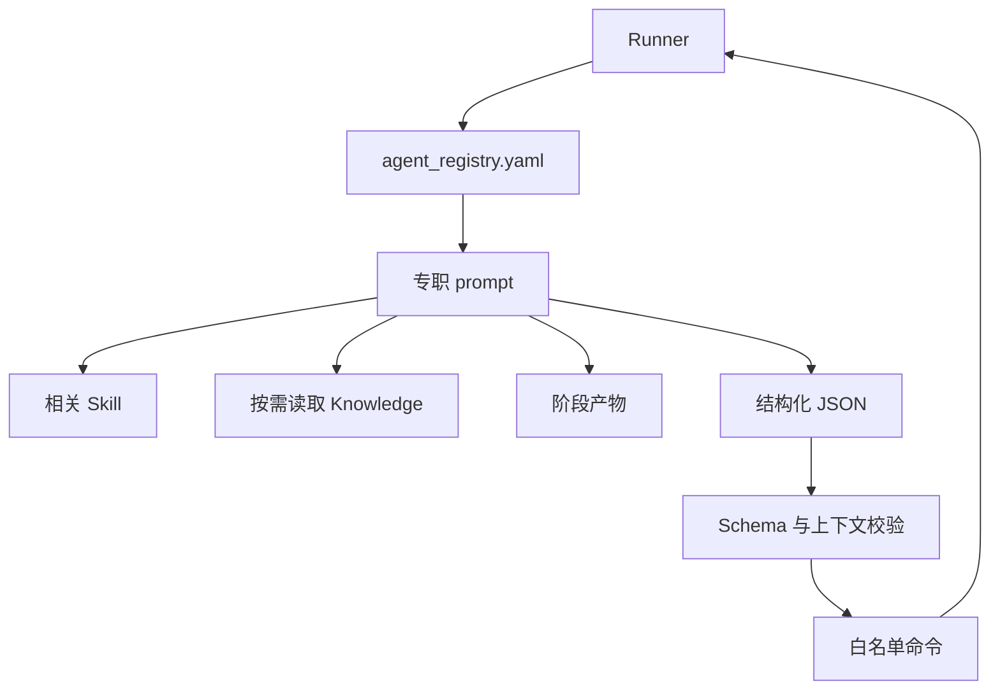

# Agent 与 Skill

专职 Agent 负责判断和产出，Skill 负责可复用操作协议，Runner 负责调度与状态。三者不能互相替代：一个 Agent 知道如何建模，不等于它有权直接宣布阶段完成。

## 角色关系



主要角色及边界：

| Agent | 输入重点 | 产出重点 | 不负责 |
|---|---|---|---|
| problem-decomposer | 题面、附件、数据 | 小问目标、约束、符号和软依赖 | 选最终模型 |
| literature-researcher | 小问、检索词、已有池 | 候选来源、元数据和证据摘要 | 伪造引用、直接接受假设 |
| assumption-manager | 题面、verified 文献 | 版本化假设、边界、偏差 | 编写最终代码 |
| mathematical-formulator | 已接受假设 | 推导、目标、约束、求解策略 | 用结果反向篡改指标 |
| implementation-agent | 公式版本、数据契约 | Python 代码、配置、任务计划 | 判断结果合理 |
| resource-manager | 任务规格、资源 | 提交异步任务 | 在 Runner 内等待长计算 |
| sanity-checker | 结果、日志、模型、文献 | 分层检查与失败路由 | 覆盖历史版本 |
| visualization-agent | 最终结果、统一样式 | 图表、脚本、manifest | 改变数值结论 |
| robustness/ablation | 完整模型 | 扰动、敏感性、内部对照 | 强制对所有题型执行 |
| cross-question-reviewer | 所有小问结论 | 冲突定位、影响范围 | 生成完整论文 |

## Knowledge 读取规则

Agent 只按当前问题读取相关条目，推荐顺序为：

```text
题目硬约束
→ 当前题目 verified + used 文献
→ knowledge 的适用条件和失败模式
→ 通用候选方法
→ Agent 推理
```

Knowledge 用于提出候选模型、检查项和检索关键词，不能作为关键假设的引用。条目与题面或当前题文献冲突时，以题面和已核验证据为准。

## 结构化返回

每个 Agent 最终只能返回满足 `config/agent_response.schema.json` 的 JSON，至少包含 action ID、上下文、状态、产物路径、发现、警告、阻塞原因、建议阶段和命令数组。数组为空也必须出现。

返回中的 `problem_id`、`question_id` 必须与动作上下文一致；产物路径必须已经存在并位于项目内；`failed` 或 `blocked` 不得携带状态变更命令。Runner 会按优先级执行命令，通常先登记产物，再登记检查结果，最后迁移阶段。

## 白名单命令

允许的命令包括登记产物、sanity、可选阶段、结论、图表复核，创建/裁决版本，清除 stale，追加 ledger，跨问审查和阶段迁移。Agent 不得直接编辑门禁字段来绕过校验。

一次响应包含多个命令时应满足原子意图：如果产物未创建，不要请求迁移；如果结果失败，不要同时请求成功状态。Runner 的 schema 校验只保证形状，Agent 仍需保证语义一致。

## Prompt 设计

专职 prompt 应说明：职责、必读输入、可写目录、完成条件、失败分类、Knowledge 路由和返回命令。不要复制全局规则到每个 prompt；全局约束由 `AGENTS.md`、`PROJECT.md` 和 `RESEARCH_LOOP.md` 提供，以减少漂移。

新增 Agent 的最小流程：

1. 明确单一职责及其必要性；
2. 创建 `agents/<name>.md`；
3. 在 registry 显式登记阶段；
4. 如需新命令，先扩展 schema、校验器和 handler；
5. 增加成功、失败、越权和恢复测试；
6. 更新 Wiki。

不要因为任务描述中出现一个新名词就新增 Agent。能由现有角色通过 Knowledge 条目处理的领域差异，应优先复用现有角色。
