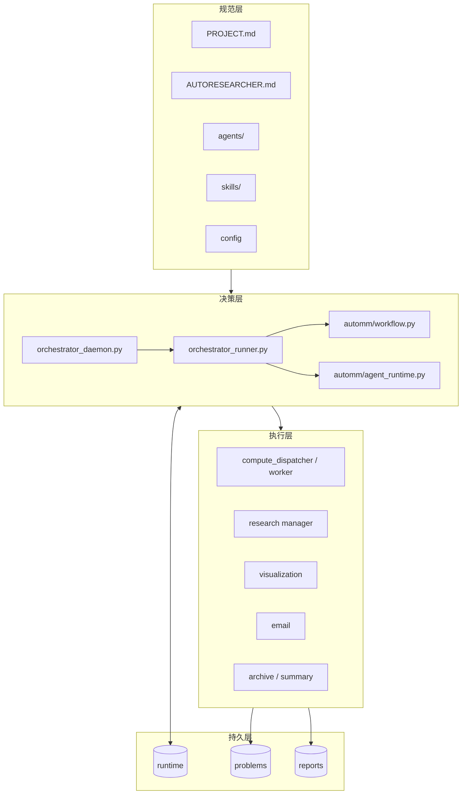
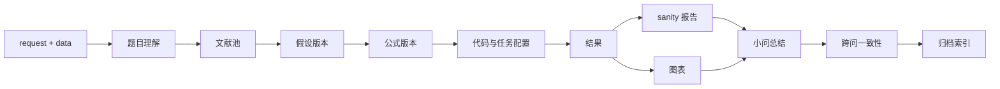

# 架构

AutoMM 把大模型研究行为限制在一个由 Python 状态机掌控的文件协议中。LLM Agent 负责产生研究内容，Runner 负责决定何时调用谁、验证返回值并持久化状态。任何单次对话都不是系统记忆。

## 四层结构

### 规范层

`PROJECT.md` 给出不可违反的工程与研究规则；`RESEARCH_LOOP.md` 定义 policy 顺序和阶段契约；`agents/` 限定角色职责；`skills/` 规定具体操作流程；`config/` 保存可调整策略。规范层不保存当前执行状态。

### 决策层

daemon 只负责周期唤醒。one-shot Runner 每次获取独占锁、对账事实、调用 `next_action()`，然后处理一个动作。`agent_runtime.py` 显式读取 registry，调用 LLM provider（dsh headless），使用 JSON Schema 验证回复，并且只执行白名单命令。

### 执行层

研究型 Agent 同步产生产物。长时间计算通过任务队列异步执行，使 Runner 不会在一次唤醒中长期占锁。文献、图表、sanity、通知和归档各有独立入口，保持单一职责。

### 持久层

`runtime/` 是进程和事务事实；`problems/` 是题目、小问、版本、结果和 manifest；`reports/` 是面向人的快照、账本和归档。持久层允许从任意会话中断恢复。

## 控制流与数据流

控制流从配置和状态进入 Runner，再流向一个 Agent 或 handler。数据流从题面和数据进入版本目录，经代码与任务生成结果，最后进入图表、检查与总结。

## 权威边界

- Runner 是“是否推进”的唯一裁决者，但它不替代专职 Agent 研究。
- Agent 可以创建自己阶段的文件，但不能直接修改 `runtime/workflow_state.json` 或门禁字段。
- schema 只验证返回结构；白名单命令与上下文检查负责约束副作用。
- `STATE.md` 是渲染视图，不是数据库。
- GitHub 仅作中转，git 工作区状态不代表工作流状态。

## 已实现与待验证

当前本地控制主链、Agent registry、结构化返回、本地任务、文献池、图表检查、邮件模块和归档模块已有代码。真实 Agent 完整动作、真实邮件、GitHub 中转、SSH 和 Kaggle 后端必须分别 smoke 后才能称为可用。远端适配器不得用占位输出伪装成功。

## 设计原则

KISS 体现在 daemon 不持有业务状态、每次仅做一个动作；DRY 体现在所有阶段共享 manifest、配置合并和白名单命令；SOLID 体现在决策、执行、研究和归档职责分离；YAGNI 体现在当前只支持 Python 计算和 Markdown 小问总结，不维护未使用的论文生成链。
