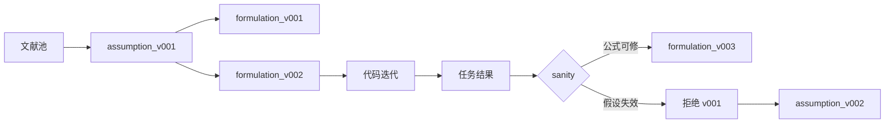
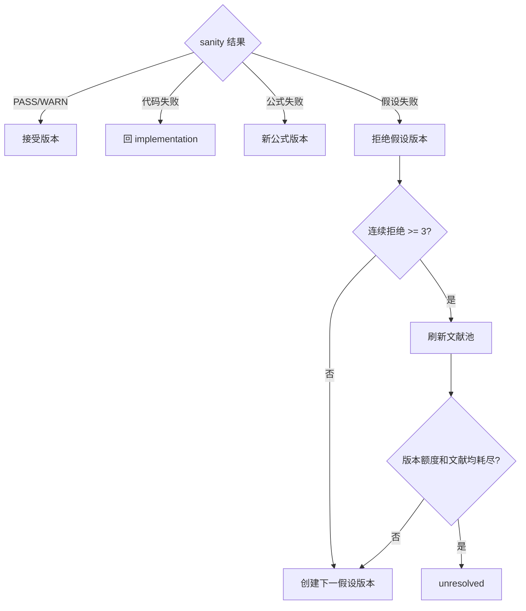

# 假设与公式版本

数学建模的核心审计对象不是某次对话，而是“证据支持的假设版本 + 可验证的公式版本”。假设改变可能重构模型，因此必须保留历史；同一假设下的实现代码允许迭代，但每次运行仍由 hash 区分。

## 两级版本结构

假设版本状态包括 candidate、under_review、accepted、rejected、deprecated 和 inherited。公式版本同样先候选、再检查、再接受。只有接受的公式版本可以创建主计算任务。

## 假设记录内容

每条假设至少记录：稳定 ID、精确陈述、类型、关键性、证据类型、引用 ID、适用范围、预期偏差方向、可观测验证、与其他假设关系和状态。类型可以是机理简化、数据生成、统计独立性、边界条件、行为规则、决策偏好或数值近似。

“为了简化计算”不是充分理由。应解释简化忽略了什么、在哪些范围内合理、若不成立会把结论推向何方。关键假设必须有当前题文献池中 verified 且 used 的来源；项目假设与 Agent 推断必须显式区分。

## 公式版本内容

公式版本应包含变量与单位、参数、目标函数、约束、初边值条件、推导、可解性、算法选择、比较指标、复杂度和预期失效模式。比较指标要在看到结果前固定，防止事后选择有利指标。

公式检查按适用性执行：

- 符号是否在全局或局部符号表中唯一；
- 等式两边量纲是否一致；
- 边界与初值是否充足且不矛盾；
- 极限情况下是否退化为已知行为；
- 单调性、凸性、守恒或概率归一是否满足；
- 参数是否可辨识，模型是否存在解；
- 离散化和求解器是否与问题性质匹配。

## 拒绝与刷新

`NEEDS_REVISION` 表示当前假设仍可保留，通常新建公式版本或修复代码。`VERSION_REJECTED` 表示假设本身不可接受，关闭当前目录并创建新假设版本。连续三个假设版本被拒绝时刷新文献池；每问最多五个版本。文献池 dry 且版本用尽时标记 unresolved，停止整题自动推进。

## 下游影响

前问结论通过 `conclusion_id/version/content_hash` 被后问引用。假设、公式或结果变化导致结论 hash 改变时，Orchestrator 根据依赖图标记下游产物 stale。没有语义影响的格式修改不应触发整链重跑；数值、单位、适用范围或结论方向变化通常需要传播。

## 禁止事项

- 覆盖或删除旧假设目录；
- 在结果出现后悄悄修改比较指标；
- 用 Knowledge 条目冒充赛题文献；
- 只改代码不更新代码 hash 和任务 attempt；
- 接受量纲、边界或硬约束未闭合的 fancy 模型；
- 为通过 sanity 而人工裁剪异常结果，却不记录裁剪规则。
