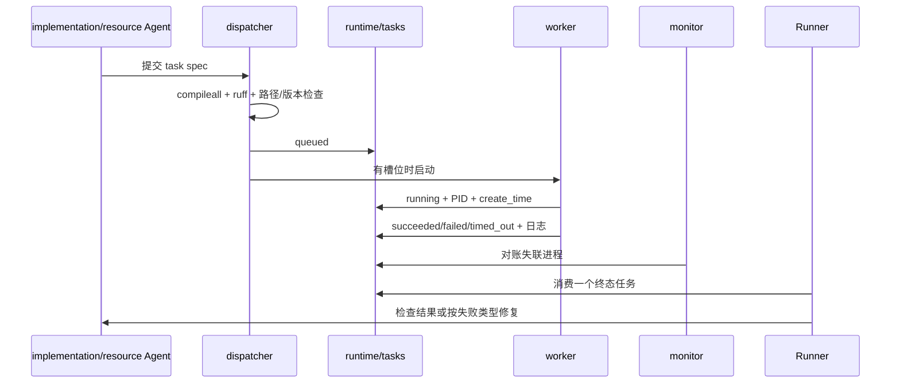

# 计算任务

计算层与研究工作流解耦。Runner 决定“是否需要计算”，dispatcher 决定“能否启动”，worker 只执行给定 Python 命令并记录退出事实，sanity-checker 再决定结果能否用于研究。

## 本地执行流

## 任务身份

task ID 的身份字段包括 problem、question、stage、代码 hash、合并配置 hash、输入 hash、假设版本和公式版本。随机种子、命令、工作目录、输出目录和环境也应进入 spec 或追踪信息。

相同身份表示相同可复现实验。queued/running/succeeded 默认拒绝重复提交。强制重跑需要原因、新 attempt 和新输出目录，避免历史结果混乱。

## 提交预检

当前正式计算仅支持 Python。代码必须通过 `compileall` 和 `ruff`；代码、配置、输入和工作目录必须存在；输出必须位于当前小问的活动或接受假设版本内；公式必须是已接受版本。命令首项只允许受支持的 Python 可执行文件。

预检只证明任务可启动，不证明算法正确。小规模单元样例、边界输入和确定性检查应由实现阶段提前准备。

## 并发与输出锁

本地不监视 GPU 使用率，只限制任务数量和内存槽位。每个任务独立目录，不允许两个任务写同一结果目录。并发适合参数组、候选算法、扰动和消融；共享只读输入可以复用，随机种子和输出必须分离。

不要一次提交大量近似重复实验。先用少量代表点验证代码和量级，再扩展并发。内存估计过低会导致系统交换或进程被杀，应根据数据规模上调 `memory_per_worker_gb`。

## 失败分类

- 语法、依赖或进程退出：implementation 自动修复一次；
- 超时：缩小问题、改算法或调整资源后最多重试两次；
- worker 消失：标记 interrupted，不能假定成功；
- 输出缺失/损坏：计算失败或 completeness sanity 失败；
- 数值异常但进程成功：进入 sanity 路由，不盲目重跑；
- 重复 ID 或输出冲突：阻止提交并要求修正规格。

## 远端后端契约

后端应实现一致的 `push → submit → poll → pull → verify` 生命周期，向上层返回 queued/running/succeeded/failed/timed_out/lost。GitHub 只做代码、配置、允许的数据和结果中转，不作为状态数据库。

SSH 后端需要验证主机指纹、上传清单、远端工作目录、PID/作业 ID、心跳、退出码、日志、结果 hash 和清理策略。远端不稳定时定期轮询，进程被 kill 或主机失联必须报告 lost，并按幂等策略决定是否重试。

Kaggle 后端需要验证 API 认证、数据集/Kernel 版本、提交限额、状态轮询、输出下载和 hash。任何 adapter 未实现或未认证时应明确返回 `NOT_IMPLEMENTED`/认证失败，禁止生成空结果后标记成功。

## 结果消费

Runner 一次只消费一个新终态任务。成功任务先归档日志和结果，再由 sanity Agent 检查；失败任务按 failure_type 路由。任务只有被 Runner 使用后才标记 consumed，相关 manifest 闭合后再 archived。
