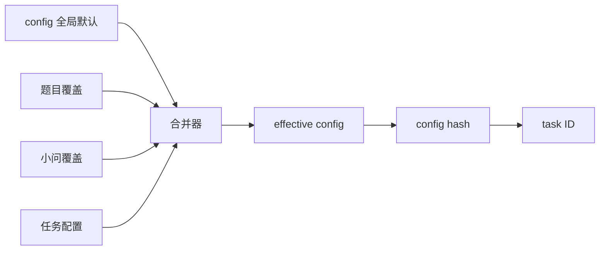

# 配置

配置是可调整策略，不是运行状态。修改配置会影响后续动作；已经提交的任务继续使用任务 spec 中固化的合并配置和 hash。测试时每次只改变一类配置，便于判断故障来源。

## 配置层级



低层级覆盖高层级时只覆盖明确字段，不应复制整份全局配置。最终任务必须保存 effective config 或其可重构来源，并登记 hash。这样配置改变后会产生新 task ID，避免把不同实验混成同一结果。

## 工作流配置

`workflow.yaml` 控制模式、唤醒间隔、小问命名、串并行策略、版本上限和阶段表。全自动模式应保持：整题只有一个活动题；小问串行；同一小问实验可并发；一次唤醒一个动作。`robustness` 与 `ablation` 在阶段表中存在，但属于条件阶段。

`gates.yaml` 定义合法迁移和本地完成的必需产物。修改阶段顺序时必须同步更新这两个文件和 `workflow.py`，否则严格迁移检查会拒绝跳转。

## Orchestrator 与 Agent

`orchestrator.yaml` 定义 one-shot、邮件轮询、事务目录、daemon 锁和失败策略。生产运行保持 `max_actions_per_wake: 1`。测试可以缩短轮询间隔，不应增加单次动作数。

`agent_registry.yaml` 是唯一 Agent 注册表。每项明确 prompt 路径和负责阶段；禁用角色使用 `enabled: false`。`agent_runtime.yaml` 控制 LLM provider（dsh_headless / codex_exec）、schema、超时、sandbox、模型和能力探针。不要依赖目录扫描自动发现 Agent。

## 计算配置

有效本地 worker 数为：

```text
min(max_local_concurrent_tasks, max(1, cpu_count - 1), memory_slots)
```

`memory_slots` 由可用内存和 `memory_per_worker_gb` 估算。默认禁止相同 task ID 重复运行。代码错误自动修复一次，超时在调整资源后最多重试两次。`task_timeout_seconds: 0` 表示不设统一超时，真实赛题应按任务设置合理值。

远端字段描述目标接口，不代表后端已通过测试。SSH 和 Kaggle 的轮询间隔、心跳、重试必须在真实 smoke 后确定。

## 文献与 sanity

`research.yaml` 限定每问候选条数、单轮时间和元数据核验提供方。关键假设必须关联 `verified` 且 `used` 的来源。Knowledge 条目不是题目来源，仍需进入当前题文献池核验。

`sanity_check.yaml` 定义六层检查、四种状态和失败路由。物理/经济常识、关键假设引用和跨问一致性为硬门禁；社会常识通常为警告。若题目领域需要更严格标准，应在题目覆盖中显式升级，而不是写死到 Agent prompt。

## 图表与归档

`visualization.yaml` 是全局风格入口。字体按首选与 fallback 顺序自动探测；色板、尺寸、DPI、最小分辨率和每问最少图数均在此修改。图表脚本不得私自维护另一套色板。

`summary.yaml` 应服务于每小问总结和归档索引。`paper.yaml` 保持禁用；系统不等待人工批准生成论文，也不学习论文口吻。若保留 `final_summary.md`，其中只能汇集链接、版本和跨问审查结果。

## 凭据

SSH password/private key、Kaggle API key 和邮件凭据只在对应真实测试中启用。项目允许同步完整 `config/` 到 GitHub，但应使用私有仓库和最小权限账号。日志不得打印完整密钥。变更凭据后先做只读认证，再做上传或启动任务。

## 变更检查表

- YAML 能被解析，路径均为项目相对路径；
- 枚举值与代码一致；
- 合并后配置能计算稳定 hash；
- 改动不会使已运行任务失去解释；
- 新后端或新阶段有明确的失败状态，不能返回假成功；
- 文档和示例同步更新。
