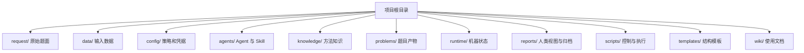

# 目录与文件契约

目录结构既是归档方式，也是 Agent 的权限边界。所有项目内引用使用相对路径；Python 代码使用 `pathlib`。任何产物都必须能从项目根目录解析，禁止把个人机器绝对路径写入 manifest。

## 总览



## 输入目录

`request/problem.md` 是规范题面；`request/attachments/` 保存原始附件；`data/` 保存数据和来源说明。研究代码不得覆盖这些文件。若必须清洗或转换，在当前假设版本的中间目录生成派生数据，并记录输入 hash 和转换脚本。

## 配置目录

`config/` 保存全局策略。题目和小问可以有覆盖配置，合并后配置必须计算 hash 并进入任务身份。配置中的凭据可能会同步到 GitHub，这是本项目明确接受的风险，但实际仓库访问范围仍应最小化。

关键文件：

- `workflow.yaml`：阶段、并发语义和版本上限；
- `gates.yaml`：合法迁移和完成产物；
- `orchestrator.yaml`：Runner、事务、daemon 和失败策略；
- `agent_registry.yaml`、`agent_runtime.yaml`：Agent 显式注册和 LLM 调用；
- `compute.yaml`：并发、任务指纹、重试和远端预留；
- `research.yaml`：文献配额、来源核验和 dry 条件；
- `sanity_check.yaml`：检查层级、硬门禁和回退路由；
- `visualization.yaml`：统一字体、配色、尺寸和质检；
- `notifications.yaml`：邮件通知与控制；
- `summary.yaml`：小问总结汇集和归档索引；
- `paper.yaml`：保持禁用。

## 题目目录

```text
problems/<problem_id>/
  problem_state.json
  dependency_graph.yaml
  global_symbols.yaml
  citations.yaml
  figures.yaml
  prob01/
    question_manifest.yaml
    shared/
    versions/
      assumption_v001/
        assumption.yaml
        formulations/formulation_v001/
        code/
        configs/
        results/
        logs/
        figures/
        sanity/
        question_summary.md
```

假设版本目录不可覆盖、重命名或删除。同一假设版本的工作代码可以迭代，但任务会记录代码 hash；新一次计算不得覆盖旧 attempt 的结果。`shared/` 只放该小问所有版本共同使用的只读材料，不放会被静默更新的结论。

## Runtime

`runtime/workflow_state.json` 是全局机器状态。`runtime/tasks/<task_id>/` 保存任务 spec、最新状态、逐 attempt 快照和日志；`runtime/actions/<action_id>/` 保存 LLM 调用证据；`transactions.jsonl`、`events.jsonl`、`agent_commands.jsonl` 都是追加日志。

`runtime/flags/` 和 `runtime/locks/` 是控制协调文件。它们可以由 CLI 或邮件模块生成，但不应被 Agent 随意创建。`__pycache__`、检索缓存等属于可重建数据，可以按清理策略移动到 `.trash/`。

## Reports

`reports/autoresearch/STATE.md` 是机器状态的人类可读投影；`experiment_ledger.md` 记录决策和实验历史；最终归档按题目组织。报告不是状态输入，手工改报告不会推进流程。

当前交付以每小问总结为核心。整题级文件仅承担目录、交叉引用、跨问审查结论和归档完整性说明，不生成完整论文。

## 写权限矩阵

| 对象 | 谁可写 | 规则 |
|---|---|---|
| 题面、原始附件、原始数据 | 人类 | Agent 只读 |
| 阶段产物 | 对应专职 Agent | 仅当前题目/小问/版本 |
| workflow state、门禁字段 | Runner | Agent 通过白名单命令申请 |
| task status | dispatcher/worker/monitor | 原子写入，逐 attempt 留档 |
| STATE 快照 | 渲染器 | 不作事实来源 |
| ledger、事件、事务 | 控制层 | 只追加，不改历史 |
| knowledge | 维护者 | 通用方法，不写题目结论 |

## 清理规则

允许清理的只有缓存、临时转换文件和确定可重建中间物。默认先移动到 `.trash/` 并保留七天。结果、日志、manifest、引用、小问总结、已使用版本和任务 attempt 不得清理。执行批量清理前先用 `cleanup_manager.py list` 检查精确目标。
