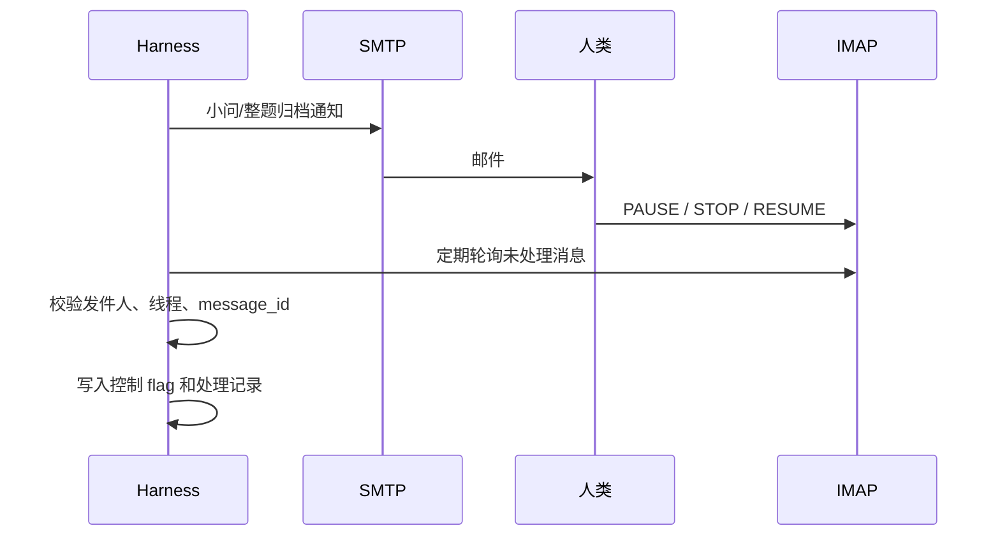

# 邮件通知与控制

邮件承担两类职责：向人类发送单向进度通知，以及接收经过鉴权的 PAUSE/STOP/RESUME 控制命令。小问完成通知不等待回复，系统不会再通过邮件请求批准生成论文。

## 流程

## 通知内容

小问首次进入 locally completed 时发送题目 ID、小问 ID、接受的假设/公式版本、主要结论、sanity 状态、可选实验状态、图表和总结路径、下一阶段。所有小问跨问审查和归档完成后发送整题完成通知，内容以各小问归档链接和审查结果为主。

通知失败应记录并最多重试三次，达到上限后工作流继续并保留警告。邮件服务不可用不应丢失研究产物。

## 控制语义

- `PAUSE`：不启动新 Agent 或新任务；保留 queued；继续监控 running 和邮箱。
- `STOP`：不启动新动作并取消 queued；默认不强杀 running，避免损坏结果。
- `RESUME`：清除暂停/停止状态，先对账 PID、任务、输出和 stale，再恢复调度。

优先级为 STOP > PAUSE > RESUME。同一轮收到冲突命令时按优先级处理并记录所有 message ID。

## 鉴权与幂等

只接受配置白名单中的发件人和预期线程/主题规则。每个 message ID 只能处理一次；已处理 ID 持久化，daemon 重启后仍能去重。命令应从规范化纯文本中解析，不执行邮件中的脚本、附件或任意参数。

凭据优先来自环境变量或受限配置。日志可以记录账号标识和服务器，但不得输出完整密码、token 或邮件正文中的敏感信息。

## 真实测试顺序

先测试 SMTP 向测试邮箱发送无敏感内容，再测试 IMAP 只读列出目标文件夹，然后用白名单账号发送 PAUSE，确认重复轮询不重复执行；再测 STOP/RESUME 和离线恢复。最后才让 daemon 在每次唤醒前自动轮询。

测试应覆盖 TLS/SSL、证书错误、认证失败、超时、连接中断、错误发件人、重复 message ID、大小写和空白差异。真实邮件测试属于网络请求且会发送信息，执行前应确认目标账号和内容。
