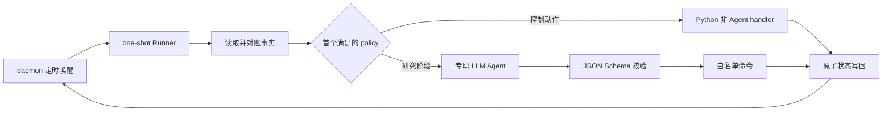

# AutoMM Wiki

本 Wiki 是 AutoMM 全自动数学建模 harness 的控制层手册。它解释系统如何把一道含多个小问的赛题转化为可恢复、可审计的研究流程，以及人类应如何配置、观察、暂停和排错。方法知识不放在这里；模型选择、检验方法和图表设计见 [`../knowledge/README.md`](../knowledge/README.md)。

## 阅读路线

第一次运行按以下顺序阅读：

1. [`quick-start.md`](quick-start.md)：创建 `.venv`、安装依赖、准备题面和初始化题目。
2. [`architecture.md`](architecture.md)：控制层、执行层、记忆层和研究产物如何分工。
3. [`main-loop.md`](main-loop.md)：daemon、one-shot Runner、Agent 与异步任务组成的主循环。
4. [`workflow-states.md`](workflow-states.md)：小问阶段、状态转移和完成条件。
5. [`directory-contracts.md`](directory-contracts.md)：哪些目录可写、哪些文件是事实来源。

运行和维护时重点阅读：

- [`configuration.md`](configuration.md)：配置覆盖关系和关键开关。
- [`agents-and-skills.md`](agents-and-skills.md)：专职 Agent、Skill 和结构化返回协议。
- [`assumptions-formulations.md`](assumptions-formulations.md)：假设版本与公式版本。
- [`literature-citations.md`](literature-citations.md)：文献池、证据等级和引用闭合。
- [`compute-tasks.md`](compute-tasks.md)：本地任务、并发、去重和后续远端后端。
- [`sanity-check.md`](sanity-check.md)：六层合理性检查和失败路由。
- [`visualization.md`](visualization.md)：图表门禁、稳定 ID 和统一风格。
- [`email-control.md`](email-control.md)：SMTP 通知与 IMAP 控制命令。
- [`summaries-archives.md`](summaries-archives.md)：每小问总结、整题索引和归档。
- [`recovery-stale.md`](recovery-stale.md)：中断恢复、过期锁和下游失效传播。
- [`cli-reference.md`](cli-reference.md)：命令行入口速查。
- [`troubleshooting.md`](troubleshooting.md)：常见故障与扩展边界。

## 一句话主循环

```text
定时唤醒 → 读取机器事实 → 对账进程和控制命令 → 选择唯一下一动作
→ 调用一个专职 Agent 或处理一个非 Agent 动作 → 校验结构化结果
→ 应用白名单状态命令 → 原子落盘 → 等待下次唤醒
```



## 系统边界

AutoMM 不以 leaderboard 分数作为唯一目标。接受一个小问需要同时满足题目硬约束、关键假设证据、模型可解释性、数值合理性、跨小问一致性和可追溯性。复杂或新颖的方法只是候选方案，不能绕过 sanity 门禁。

当前交付物不是完整论文。每个小问保留独立总结、版本、代码、结果、图表、引用和检查报告；所有小问完成后只做跨问审查和归档索引。`config/paper.yaml` 保持禁用。若当前实现仍生成 `reports/final_summary.md`，应把它理解为各小问归档的导航索引，而不是论文正文。

## 事实优先级

发生冲突时按下列顺序判断：

```text
题面和附件中的硬约束
> runtime 与 problem manifest 的机器状态
> 当前题目已核验且 used 的文献
> 已接受的假设/公式版本
> knowledge 中的方法建议
> Agent 临时推理或聊天记录
```

Wiki 描述应始终与代码和配置同步。未做真实 smoke 的能力只能标为“已实现待验证”或“规划中”，不能写成已通过。
