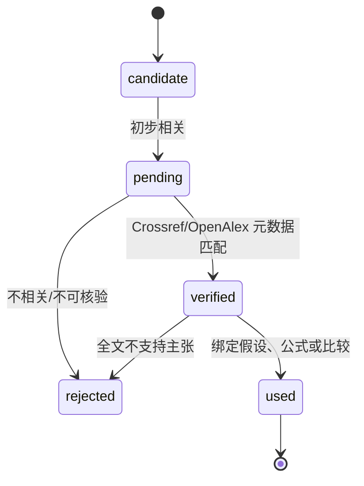

# 文献与引用

文献模块的目标不是堆积条目，而是为关键假设、公式来源、参数范围和合理性比较建立可核验链。每个小问维护独立文献池，整题维护统一引用表，避免同一来源重复编号或元数据不一致。

## 文献生命周期



搜索摘要只能帮助筛选，不能单独支撑关键主张。元数据 verified 只说明文献身份可靠，不说明它确实支持当前断言；进入 used 前仍需记录原文位置、支持内容和适用边界。

## 来源等级

- A：同行评审期刊、主要会议、标准组织正式文件；
- B：权威教材、政府/机构报告、成熟技术报告；
- C：预印本、普通会议、学位论文；
- D：网页、博客、厂商说明、搜索摘要。

关键假设和核心公式优先使用 A/B。C 可用于新方法候选和补充，D 适合定义、数据入口或检索线索。来源等级不自动等于结论质量，还要检查样本、领域和时效性。

## 每条记录

至少保存 citation ID、标题、作者、年份、来源、DOI/URL、authority tier、metadata status、usage status、访问日期、支持的主张、原文定位、适用性备注和拒绝理由。禁止猜测 DOI、作者顺序或文献结论。

题目中使用的参数范围应说明是直接采用、单位换算、插值、外推还是校准所得。外推必须成为 sanity 和敏感性检查对象。

## 检索策略

检索词由对象、机制、方法和限制条件组成。例如：

```text
对象同义词 + 机理关键词 + mathematical model
核心决策 + optimization + constraints
参数名 + empirical range + 单位
方法名 + assumptions + failure / sensitivity
```

Knowledge 中每个方法条目给出中英文检索词，但检索结果必须进入当前小问文献池。先查综述和权威教材建立术语，再查近年原始研究和领域参数，最后做反向/正向引文追踪。

## 配额与 dry

默认每问最多 25 个条目、单轮最多 30 分钟。达到条目/时间上限、候选全部裁决、或一轮没有新假设族时视为 dry。dry 不等于没有文献，而是继续同样检索的边际收益太低。

连续三个假设版本被拒绝会触发刷新。刷新必须更换术语、假设族或证据路径，不能重复同一查询。版本额度和文献池同时耗尽才进入 unresolved。

## 引用闭合检查

小问完成前逐项检查：

1. 每个关键假设有 citation ID；
2. citation 存在于题目引用表；
3. metadata 为 verified，usage 为 used；
4. 支持内容与假设陈述一致，不扩大原文结论；
5. 单位、对象、时间和地域具有可迁移性；
6. 小问总结中的引用都能回到具体主张；
7. 未使用来源不进入最终引用列表。

## 与 Knowledge 的边界

`knowledge/` 是方法导航：说明一个方法何时适用、如何检查、搜索什么。它不因 frontmatter 中写了 `verified` 就成为当前赛题证据。关键假设必须重新由题目文献系统核验。若通用知识与题目数据冲突，应记录冲突并优先相信题目硬约束或更贴近当前场景的证据。
