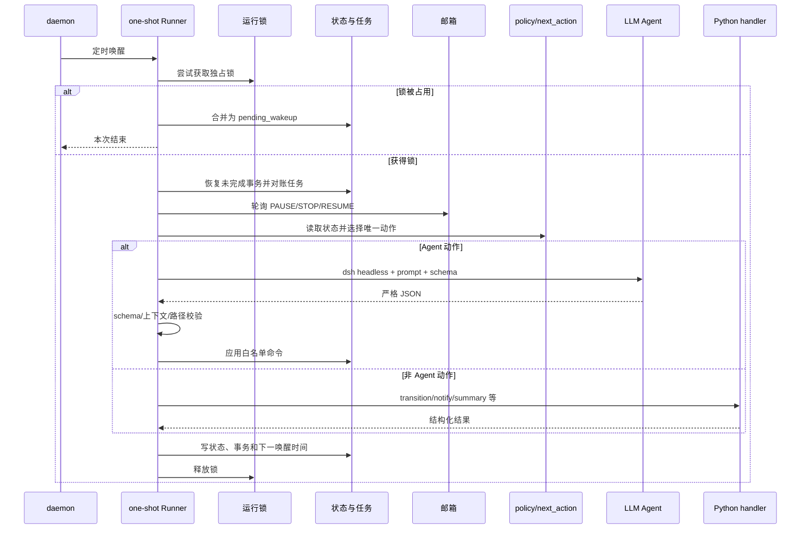

# 主循环

主循环由长寿命 daemon 和短寿命 Runner 两部分组成。daemon 提供时间上的持续性，Runner 提供动作级原子性。一次唤醒失败不会让整个研究过程丢失，因为下一次 Runner 从文件事实重新决策。

## 时序



## 一次 Runner 的固定步骤

1. 生成唯一 `action_id`。
2. 获取 `runtime/locks/orchestrator.lock`；失败时只登记一次待唤醒。
3. 在事务日志写入 `started`。
4. 对上次未提交事务做“记录但不重放”的恢复。
5. 应用控制 flag，核对本地 worker 的 PID、创建时间与命令行。
6. 轮询控制邮箱。
7. 调用 `next_action()`，按 policy 优先级选第一个成立的动作。
8. 若为 Agent 动作，显式从 registry 加载角色并调用 LLM provider；若为内置动作，调用 Python handler。
9. 校验并应用结果，更新任务 consumed 状态。
10. 原子保存 workflow state，追加事件和事务 `committed`。
11. 无论成功失败都释放锁。

异常会写入 `workflow_state.blocking`、事件和事务日志。Runner 不应在异常后偷偷继续第二个动作。

## Policy 顺序

概念优先级如下，实际行为以 `scripts/automm/workflow.py` 为准：

```text
控制命令
→ 等待题目初始化
→ 消费已结束计算/路由计算失败
→ 处理当前小问待执行阶段
→ 发送小问完成通知
→ 推进下一小问
→ 跨小问审查
→ 生成归档索引并发送整题通知
→ idle
```

顺序的意义是先处理外部控制和已发生事实，再创建新工作。若一个计算已经结束，系统先消费它，而不是继续提交更多任务。

## 同步与异步边界

题目理解、文献筛选、假设、推导、sanity 和图表审查等研究动作在一次 Agent 调用中同步完成。计算型动作只创建任务并返回，worker 在锁外运行。后续唤醒通过 `status.json` 消费成功或失败结果。

同一小问内可以有并发实验，但主阶段严格顺序，小问之间也严格顺序。并发的对象是参数组、候选算法、扰动或消融任务，不是两个 Agent 同时修改同一 manifest。

## 幂等与去重

- `action_id` 标识一次 Runner 决策。
- task ID 由题目、小问、阶段、代码/配置/输入 hash、假设版本和公式版本共同决定。
- 相同 ID 的 queued/running/succeeded 任务拒绝重复提交。
- 强制重跑必须说明原因、增加 attempt 且使用新输出目录。
- Agent 产物路径必须存在且位于项目内，不能用文字声明一个未创建文件。

## 空闲不是失败

没有活动题目、处于暂停、等待计算或当前没有可执行动作时，Runner 可以返回 idle/wait。它仍应更新时间、监控进程和邮件。不得为了看起来“有进展”而创建无意义检索、重复计算或新假设版本。

## 观察主循环

一次动作应能在以下位置串起来：

```text
runtime/transactions.jsonl       action started/decided/committed
runtime/actions/<action_id>/     prompt 调用的 stdout/stderr/response/status
runtime/agent_commands.jsonl     已执行的白名单命令
runtime/events.jsonl             状态事件
reports/autoresearch/STATE.md    人类可读快照
```

若中间链条断裂，应先查事务阶段和 Runner stderr，再查 Agent 的 schema 或路径错误，不要直接改最终状态。
