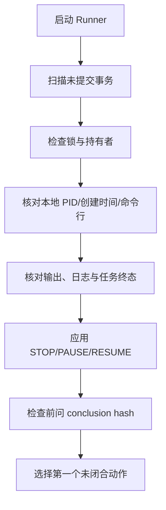
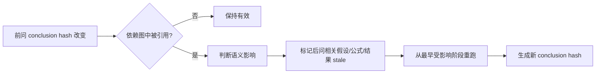

# 恢复与 stale 传播

恢复的基本原则是“从机器事实继续，不重放不确定副作用”。Runner 崩溃、模型会话结束、电脑重启或远端任务失联，都不应导致从头重做整道题。

## 恢复顺序

事务日志中只有 started/decided、没有 committed/failed 的动作会被登记为 `recovered_incomplete`，但不会自动重放 Agent 命令、邮件或任务提交。之后根据产物和 task ID 对账，判断副作用是否已经发生。

## 锁恢复

Runner 锁记录 holder、时间和 action ID。超过配置期限不能直接删除；先确认对应进程不存在、事务未继续、任务状态可对账，再回收。并发唤醒只合并为一个 pending flag，避免重启后积压多个相同动作。

daemon 自身也有 PID/锁/停止 flag。daemon 活着不代表 Runner 正常，需同时检查 daemon log 和最近事务时间。

## 本地任务中断

monitor 使用 PID、进程创建时间和命令行共同判断 worker，防止 PID 复用。状态为 running 但 worker 不存在，且没有写终态时，标记 `failed/interrupted`。若结果文件存在仍需验证完整性和 hash，不能自动改 succeeded。

重复任务优先复用已成功结果。失败重试使用新 attempt 和新输出目录。修复代码会改变 hash，从而生成不同 task ID。

## stale 传播

触发传播的变化包括数值、单位、定义、时间范围、适用边界或结论方向。拼写、格式、图表样式等不改变语义的变化不应造成重算。依赖图是软依赖：每次传播要记录为何受影响，而非默认所有后问全部失效。

stale 不是 rejected。旧产物仍正确地代表旧输入和旧结论，只是不能继续作为当前最终链的一部分。清除 stale 前必须生成或验证替代产物，并通过白名单命令记录理由。

## 远端恢复

SSH/Kaggle 后端需要保存远端 job ID、提交时间、工作目录、代码/配置 hash、最近心跳和下载状态。超出心跳窗口标记 lost；先查询平台真实状态，再决定重连、拉取或重试。禁止因为一次网络超时立即重复提交付费或长任务。

## 人工修复边界

人类可以修复配置、凭据和代码，然后执行 reconcile/RESUME。不要直接把 manifest 改成 completed。若不得不手工修复机器状态，应先备份相关 JSON、在 ledger 说明原因，并运行校验命令确认不变量。
