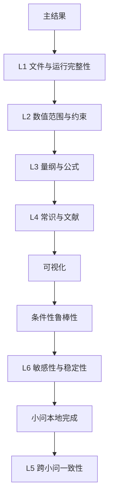
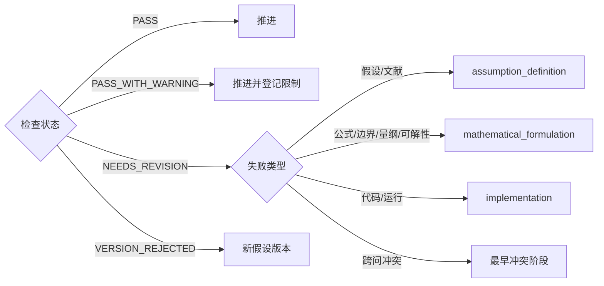

# Sanity-check

Sanity-check 替代 Kaggle 型 harness 的 submit gate 和单一 eval 分数。它回答的不是“分数是否更高”，而是“结果是否能在题目、数学、数据、文献、常识和上下问关系中成立”。

## 六层检查

L1 检查进程终态、返回码、必需文件、日志、输入/配置/代码 hash、随机种子和非空输出。L2 检查变量定义域、概率归一、非负性、容量/预算/守恒约束、缺失/无穷/NaN 和数量级。L3 检查单位、公式实现、边界、极限、单调性、可解性和离散误差。L4 比较物理/经济常识、领域文献、数据证据和社会常识。L5 在所有小问完成后检查共同符号、参数、数据和结论。L6 在扰动与敏感性实验后判断模型是否稳健。

## 硬门禁与警告

关键假设引用、物理/经济常识和跨小问一致性是硬门禁。社会常识通常产生警告，因为规范判断可能依赖背景；但题目若把社会规则写成硬约束，则升级为硬门禁。数据支持、量纲、极端行为和结果影响的默认严重性以配置为准，具体报告仍需解释。

硬门禁失败不能用漂亮图表、复杂算法或局部高拟合度抵消。警告允许推进，但必须写入小问总结的限制与适用范围。

## 状态与路由

报告必须给出证据、阈值、实际值、严重性、影响范围和路由理由。不要只写“结果合理”。若阈值来自题面或文献，登记来源；若来自建模者决策，标为 team decision 并做敏感性分析。

## 合理性比较

文献比较应匹配对象、单位、时间尺度和场景，不能只因数字相近就通过。常识比较至少给出数量级推理。跨问比较应从被引用的 conclusion hash 出发，检查后问是否仍使用旧参数或旧结果。

对于无唯一真值的问题，可以使用多重证据：约束残差、模拟回代、极端场景、替代算法、历史区间、内部基准和专家规则。它们共同提升可信度，但不能冒充外部 ground truth。

## 鲁棒性与消融

是否触发由 Agent 根据模型决定。默认扰动可参考参数 ±5%、±10%、±20%，随机实验至少 100 次、区间 95%，但必须结合题目重设。消融以完整模型为内部对照，选择 3–4 个关键项或约束，比较结论变化而非只比较运行速度。

解析恒等式或无可调组件的模型可以跳过消融；纯确定性、参数完全给定的问题可以用边界分析替代随机扰动。跳过理由进入 manifest。

## 报告最小内容

- 检查对象和对应版本/任务；
- 每层检查项、方法、阈值和证据；
- 通过项与失败项；
- 状态和失败分类；
- 对结论的影响；
- 修订或拒绝建议；
- 未解决警告。

sanity-checker 独立于结果生成 Agent。它可以请求回退，但不能直接修改数值来使结果通过。
