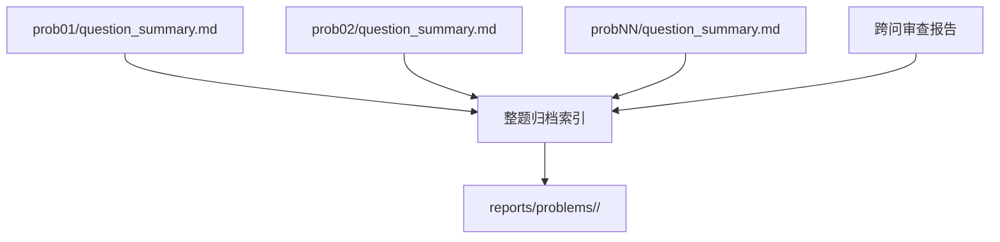

# 小问总结与归档

AutoMM 的最终内容交付以每小问总结为单位，不生成完整论文。整题完成后的文件只做导航、跨问审查与归档完整性索引，不承担论文叙事、模板套用或语言风格模仿。

## 每小问总结

接受假设版本目录中的 `question_summary.md` 至少包含：

1. 小问目标、输入与输出；
2. 接受的关键假设及其引用；
3. 模型结构、核心公式、约束和求解方法；
4. 数据处理和计算任务标识；
5. 主要结果、单位、数量级和解释；
6. sanity 状态、阈值和未解决警告；
7. robustness/ablation 结果或跳过理由；
8. 最终图表及其稳定 ID；
9. 对后续小问输出的 conclusion ID/hash；
10. 适用范围、限制和复现入口。

总结只引用已经存在的产物，不重新计算、不手工抄写未核对数值。关键结论应指向结果文件、任务和图表。引用只列本问实际 used 的来源。

## 归档结构

归档应保留题面引用、题目状态、依赖图、全局符号、每问接受版本、任务日志、结果、图表、sanity、引用和总结。旧版本仍留在 `problems/` 供审计，归档索引可以只突出接受版本。

## 整题索引的边界

若代码仍使用 `reports/final_summary.md`，该文件只能包含：题目信息、各小问总结链接、接受版本、跨问一致性结果、共同符号/参数、图表与引用索引、复现和限制。不得自动扩写为摘要、引言、完整方法、论文结论或参考论文口吻。

文件名 `final_summary` 是实现遗留命名，不改变当前产品定义。后续可在不破坏兼容性的前提下改为 archive index。

## 完成门禁

小问总结生成前必须 locally completed；整题索引生成前必须所有小问完成且跨问审查通过。总结引用的文件必须存在；图表自动和视觉检查通过；关键假设引用闭合；任务日志和 hash 可追踪。

邮件通知应包含归档路径，不把大图或全部结果塞进邮件。归档失败不应将整题标记 completed。

## 版本与更新

若跨问审查导致前问修订，旧总结随旧版本保留，新接受版本生成新总结，整题索引更新链接和结论 hash。禁止覆盖旧版本后让历史 ledger 指向新内容。

总结写作规范和模板见 [`../knowledge/question-summary.md`](../knowledge/question-summary.md)。
