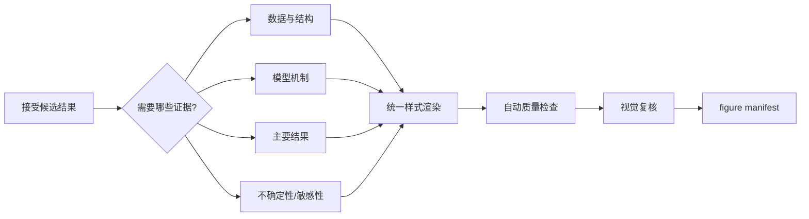

# 可视化

图表既是结果展示，也是诊断工具。每个小问在接受版本上生成一组功能互补的图，不为了凑数量重复表达同一信息。所有样式从 `config/visualization.yaml` 读取。

## 触发时机

主结果完成且 sanity Level 1–4 为 PASS 或允许的 WARNING 后进入正式可视化。实现阶段可生成诊断图，但它们不计入最终图数。公式或假设版本被拒绝后，旧图保留在旧版本目录，不进入最终 manifest。

## 图表选择

每问至少五张通过门禁的最终图，但选择取决于问题：数据分布/缺失、空间或网络结构、模型流程/变量关系、拟合或预测、优化权衡、残差与误差、敏感性/场景、跨问传递关系等。一个图应回答一个明确问题，并有可独立理解的标题、轴、单位、图例和说明。

鼓励在第三维具有真实语义时使用三维可视化，例如空间结构、响应曲面、动态轨迹、多变量关系和优化目标景观。三维图应选择能揭示结构的视角，并检查遮挡、透视失真和深度辨识；静态投影可能造成歧义时，配套提供二维投影、切片或等高线。避免只为视觉效果使用伪三维柱状图。无必要双轴、彩虹色图、过多类别和装饰性渐变同样应避免。高级图形应实际提升信息表达。

## 稳定 ID 与可追溯性

稳定图 ID 由小问、图类型、标题、源数据 hash、变量和样式 hash 生成。登记项至少包含路径、生成脚本、输入、版本、任务、标题、caption、自动质检和视觉复核。数据或语义变化会产生新 ID；仅重新导出同一语义时仍需保留生成记录。

## 字体与风格

系统先尝试 `Microsoft YaHei`，再按配置检查 PingFang SC、Noto/Source Han、文泉驿、黑体等中文字体。找不到中文字体时应阻止含中文标签的正式出图或使用明确记录的替代方案，不能静默产生方框字符。

图表脚本只消费统一的色板、字体、字号、尺寸、DPI 和背景设置。题目级风格覆盖应通过配置，而不是逐脚本硬编码。PNG 是强制交付格式；源脚本和数据引用同样必须归档。

## 自动与视觉门禁

自动检查至少覆盖：文件可读、非空/非纯色、最小 800×480、边界暗像素异常和 manifest 完整性。视觉复核检查字体、裁切、重叠、图例、单位、颜色、数值方向、信息层级和是否误导。

自动检查无法证明标签没有重叠，也无法判断图意是否正确，因此视觉复核不可省略。复核失败状态为 `needs_revision`，生成新图或修复后再次登记，不直接改为 passed。

## 图文一致

小问总结引用稳定图 ID，并明确图支持哪条结论。图中数值应来自最终结果文件而非手工抄录；caption 不得提出数据未支持的新因果结论。跨问审查还要检查不同小问同一指标是否使用相同单位、颜色语义和时间范围。
