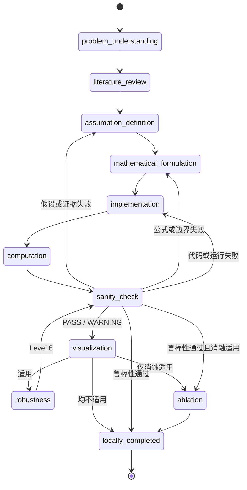
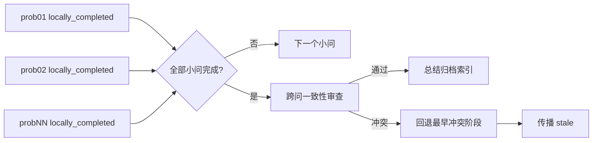
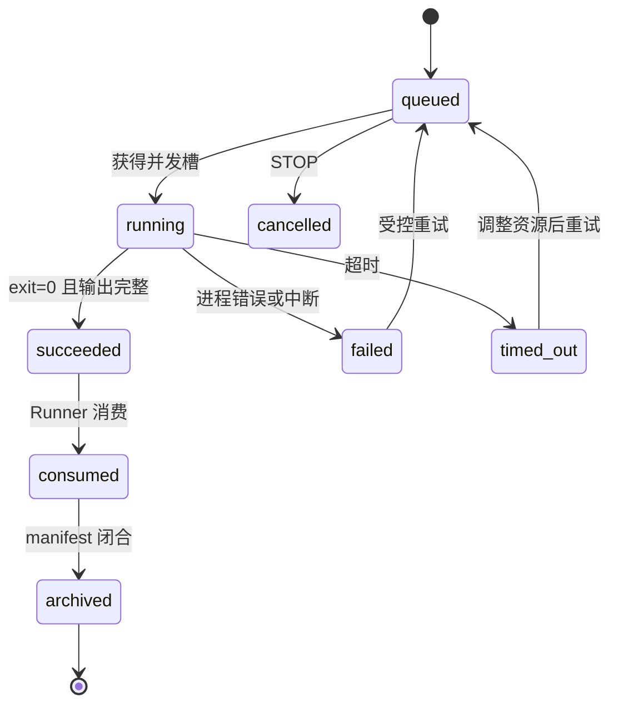

# 工作流状态

AutoMM 同时维护整题状态、小问状态、研究阶段和计算任务状态。它们不是同一个枚举：阶段表示“当前要做什么”，状态表示“对象是否可继续或已完成”。

## 小问主阶段

`robustness` 和 `ablation` 是条件阶段。Agent 必须根据题型、模型和决策风险判断是否适用；跳过时记录明确理由。不能因为时间紧而无理由跳过，也不能对纯解析问题机械做无意义的随机扰动。

## 跨小问阶段

所有小问都 `locally_completed` 后，系统执行 `cross_question_review`。审查对象包括符号、单位、共同参数、数据版本、时间范围、约束、前问输出的引用方式和结论数量级。通过后进入 `completed` 并归档；失败则定位最早冲突阶段，将受影响结果标为 stale。

## 完成契约

本地完成至少要求：

- 题目理解、小问目标和约束已归档；
- 至少一条有效文献，关键假设均绑定 verified 且 used 的来源；
- 已接受假设版本和公式版本存在；
- 实现、任务配置、日志和主要计算结果可追溯；
- sanity Level 1–4 通过或仅有允许警告；
- 最终版本图表达到配置数量，自动检查和视觉复核均通过；
- robustness/ablation 已完成或留下合理跳过记录；
- `question_summary.md` 能追溯到版本、任务、图表和引用。

`locally_completed` 不表示整题正确，只表示该小问自身闭合。后续跨问审查仍可使其下游产物失效。

## Sanity 状态语义

- `PASS`：硬门禁通过，可推进。
- `PASS_WITH_WARNING`：可推进，但警告必须进入小问总结的限制部分。
- `NEEDS_REVISION`：当前版本尚可修复，按失败类型回退。
- `VERSION_REJECTED`：拒绝当前假设版本，创建新版本，历史不可覆盖。

不要把所有失败都路由到 implementation。错误归属必须区分证据/假设、公式/边界/量纲、代码/运行和跨问冲突。

## 任务状态

“进程退出码为零”不自动等于研究结果可接受；它只表示计算执行成功，之后仍需 sanity。

## 整题状态

常见整题状态包括 `idle`、`running`、`paused`、`stopped`、`completed` 和 `unresolved`。达到假设版本上限且文献池 dry、又无法通过硬门禁时进入 unresolved，停止自动推进并通知人类。暂停与停止不是失败，恢复时必须先对账。

## 合法迁移

合法迁移由 `config/gates.yaml` 明确列举。启用 `strict_stage_transitions` 时，任何未声明跳转都会失败。新增阶段时必须同时修改阶段表、允许迁移、Agent registry、产物契约、next-action policy 和测试，不能只增加一个字符串。
